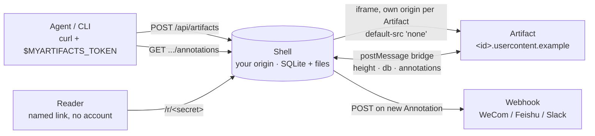
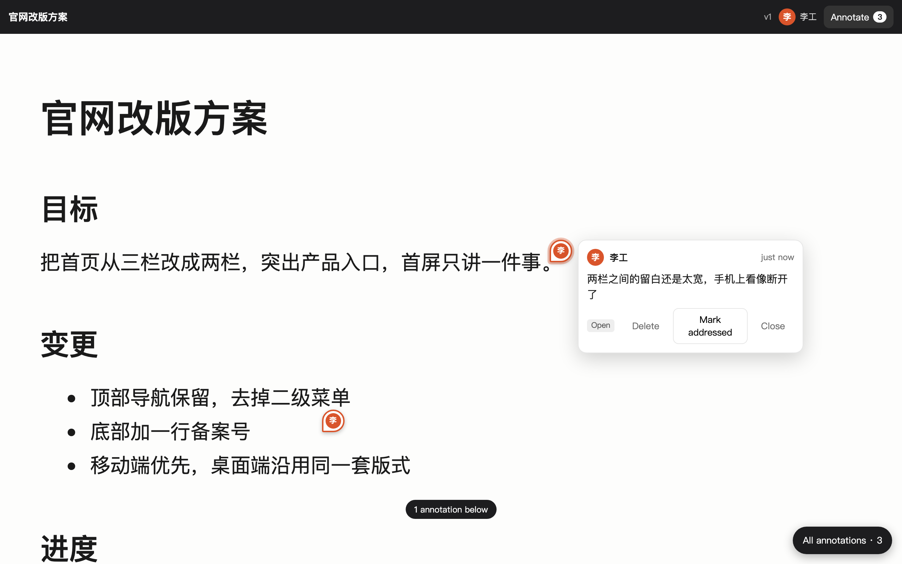

<div align="center">

# MyArtifacts

**Self-hosted Claude Code Artifacts, with the half you can't buy: your customer's comments.**

An agent publishes a page to *your* server. A customer opens a link, reads it, pins comments on it.
The agent reads the comments, publishes the next Version. No accounts, no email, no CDN.

[](https://github.com/LatentLeap/MyArtifacts/actions/workflows/ci.yml)
[](LICENSE)
[](package.json)
[](package.json)

[English](README.md) · [中文](README.zh-CN.md)

<br>

<a href="docs/media/promo.mp4"></a>

</div>

---

## Why

Claude Code can publish an artifact to `claude.ai` in one call. That's great until the person
who needs to read it can't reach `claude.ai` — a client behind a corporate firewall, a customer in
mainland China, anyone you don't want to hand a third-party link to.

MyArtifacts is the same publishing loop on a box you own, plus the feedback loop that closes it:

- **Publish** — one `POST` with the HTML or Markdown. Every publish is an immutable **Version**.
- **Share** — hand out a **Reader** link: a named, revocable URL. No sign-up on the other end.
- **Annotate** — the Reader clicks anywhere on the page and pins a comment to that element.
- **Iterate** — the agent reads the **Annotations** over the same API and publishes Version 2.
  Pins that still match carry over; the rest are marked *Detached*, never silently misplaced.
- **Notify** — every new Annotation fires one JSON `POST` to a webhook URL. WeCom, Feishu, Slack,
  whatever you point it at.

Pages written for Claude Code Artifacts run here unchanged: `claude.use("db")`, `use("user")`,
`use("downloads")`, and self-publishing through `use("artifact")` all work, because the same
capability bridge sits behind the same `postMessage` contract.

## How it holds together



Three rules the design never bends:

1. **Every Artifact gets its own origin.** Isolated from the Shell and from every other Artifact.
   The Shell can see the Artifact's rectangle and nothing inside it.
2. **The Artifact is inert; the Shell does the work.** Artifacts are served with `default-src 'none'`
   and no `connect-src`. The only script injected is the runtime: a height beacon, the `claude.use`
   stub, and the comment client, all talking to the Shell over one origin-checked channel.
3. **Nothing is public by default.** Publishing needs a token. Reading needs a Reader link.

The reasoning is written down in [`docs/adr/`](docs/adr/) and the vocabulary in
[`CONTEXT.md`](CONTEXT.md). Ten decisions, each a page, each with the options that lost.

## Run it in a minute

Node 26+. One runtime dependency (`marked`, for Markdown publishes). SQLite comes with Node.

```bash
npm install
MYARTIFACTS_DATA=./data npm run mint-token -- alice   # prints the token once
MYARTIFACTS_DATA=./data npm start
```

The Shell listens on `:8787`, Artifacts on `:8788` at `<id>.usercontent.localhost` — `*.localhost`
resolves without DNS. Open <http://localhost:8787/login>, paste the token, and you're in the gallery.

Publish a page:

```bash
export MYARTIFACTS_URL=http://localhost:8787
export MYARTIFACTS_TOKEN=…   # keep it in the environment, never on the command line

curl -fsS -H "Authorization: Bearer $MYARTIFACTS_TOKEN" \
  -H 'Content-Type: text/html' --data-binary @page.html \
  -X POST "$MYARTIFACTS_URL/api/artifacts?canvas=1200"
# → 201 {"artifact":"…","version":1,"canvas":1200,"title":"…","preview":"…"}
```

Give someone a link, then read what they pinned:

```bash
curl -fsS -H "Authorization: Bearer $MYARTIFACTS_TOKEN" -H 'Content-Type: application/json' \
  -X POST "$MYARTIFACTS_URL/api/artifacts/$ID/readers" -d '{"name":"Wang"}'
# → {"reader":"…","name":"Wang","url":"http://localhost:8787/r/…"}

curl -fsS -H "Authorization: Bearer $MYARTIFACTS_TOKEN" \
  "$MYARTIFACTS_URL/api/artifacts/$ID/annotations"
```

## Let the agent drive

The server hands out its own skill at `GET /skill.md` — unauthenticated, verbatim, the only copy
in the repo at [`skills/myartifacts/SKILL.md`](skills/myartifacts/SKILL.md). Drop it into Claude
Code and the agent knows how to migrate a `claude.ai` artifact, publish, mint Reader links, read
Annotations, and mark them addressed. All it needs is `MYARTIFACTS_URL` and `MYARTIFACTS_TOKEN`.

```bash
mkdir -p .claude/skills/myartifacts
curl -fsS "$MYARTIFACTS_URL/skill.md" -o .claude/skills/myartifacts/SKILL.md
```

## What a Reader sees



- The page, scaled to fit their screen at the **Canvas** width it was composed for. Phone, laptop,
  and publisher all look at identical geometry.
- Their own name in the header — fixed by whoever made the link, so a forwarded link still speaks
  under the original name.
- Click anywhere → pin a comment. Their pins are theirs to withdraw until the publisher addresses them.
- The latest Version by default, or the one the publisher froze them on.
- The Shell speaks the browser's language: English and Chinese out of the box.

## HTTP API

Everything the gallery UI does, it does through these. There is no second way in.

| Publisher (`Authorization: Bearer <token>`) | |
|---|---|
| `POST /api/artifacts?canvas=W` | Publish a new Artifact. Body is `text/html` or `text/markdown`. |
| `POST /api/artifacts/{id}/versions?canvas=W` | Publish the next Version. |
| `GET /api/artifacts` · `GET /api/artifacts/{id}` · `DELETE …/{id}` | List, inspect, soft-delete. Versions are kept forever. |
| `PUT /api/artifacts/{id}/pinned` `{"version":3}` | Freeze Readers on one Version. `null` unfreezes. |
| `POST /api/artifacts/{id}/readers` `{"name"}` | Mint a Reader link. `GET` lists, `DELETE …/readers/{rid}` revokes. |
| `GET /api/artifacts/{id}/annotations` | What Readers pinned, with status and anchor. |
| `PATCH /api/annotations/{id}` `{"status":"addressed"}` | Mark one addressed. |
| `POST /api/artifacts/{id}/db` | RPC door into the page's document store: `get/set/update/delete/query/acquire`. |
| `GET /api/artifacts/{id}/db/stream` | Server-sent events for the same store. |
| `GET /api/tokens` · `POST` · `DELETE /api/tokens/{name}` | Members. Revoking a token cuts its API calls and its browser session together. |

| Reader (`/r/<secret>`) | |
|---|---|
| `GET /r/{secret}` | The Shell with the page inside. |
| `POST /r/{secret}/annotations` · `GET` · `PATCH` · `DELETE …/{id}` | Pin, list, set status, withdraw. |
| `POST /r/{secret}/db` · `GET …/db/stream` | The page's `claude.use("db")`, from the Reader's side. |
| `POST /r/{secret}/versions?base=N` | A page publishing itself. `409` on a stale base. |

Limits: 16 MiB per Version, quotas on the document store, and every Annotation `POST` hits the webhook.

## Deploy

[`deploy/`](deploy/) has what a single Ubuntu box needs: a systemd unit, a Caddyfile that fronts
the Shell and the wildcard `*.usercontent.<host>` (DNS-01 for the wildcard certificate), and an
idempotent `setup.sh`. Set the three origins in `/etc/myartifacts.env`:

```
MYARTIFACTS_DATA=/var/lib/myartifacts
MYARTIFACTS_SHELL_ORIGIN=https://artifacts.example.com
MYARTIFACTS_USERCONTENT_HOST=usercontent.example.com
MYARTIFACTS_WEBHOOK_URL=https://…      # optional
```

Everything the server owns lives under `MYARTIFACTS_DATA`. Back it up with `tar`.

## Repository

```
src/server.ts     the whole server: HTTP, SQLite, Shell pages, webhook
src/shell.js      the annotation layer around the iframe
src/runtime.js    the one script injected into every Artifact
src/strings.ts    en / zh strings
skills/           the agent skill the server serves at /skill.md
test/             252 tests against the HTTP seam — npm test
docs/adr/         why it is shaped this way
deploy/           one box, Caddy + systemd
demo/promo/       the video above, a Remotion project — npx remotion render Promo
```

```bash
npm test             # node --test, no framework
npm run typecheck    # tsc --noEmit
```

## Contributing

Read [`CONTEXT.md`](CONTEXT.md) and skim [`docs/adr/`](docs/adr/) first — the terms are used
exactly, and settled decisions are not reopened without new facts. Pull requests that keep the
three rules above and come with a test at the HTTP seam are very welcome.

## License

[MIT](LICENSE) © LatentLeap
