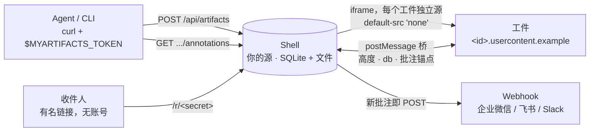

<div align="center">

# MyArtifacts

**自托管的 Claude Code Artifacts，外加买不到的那一半：客户的批注。**

Agent 把页面发布到*你自己*的服务器；客户打开一个链接，边读边在页面上钉批注；
Agent 读到批注，发布下一个版本。没有账号，没有邮件，没有 CDN。

[](https://github.com/LatentLeap/MyArtifacts/actions/workflows/ci.yml)
[](LICENSE)
[](package.json)
[](package.json)

[English](README.md) · [中文](README.zh-CN.md)

<br>

<a href="docs/media/promo.mp4"></a>

</div>

---

## 为什么

Claude Code 一条命令就能把 artifact 发布到 `claude.ai`。问题是要看的人打不开 `claude.ai`：
公司防火墙后的客户、大陆的客户、或者任何你不想递一个第三方链接过去的人。

MyArtifacts 把同一套发布流程搬到你自己的机器上，并补上闭环的另一半——反馈：

- **发布** —— 一个 `POST`，正文是 HTML 或 Markdown。每次发布都是一个不可变的**版本**。
- **分享** —— 发一个**收件人**链接：有名字、可撤销的 URL。对方无需注册。
- **批注** —— 收件人点页面任意位置，把评论钉在那个元素上。
- **迭代** —— Agent 通过同一套 API 读**批注**，发布第 2 版。还对得上的批注自动带过去，
  对不上的标为*位置已失效*，绝不悄悄钉错地方。
- **通知** —— 每条新批注向一个 webhook URL 发一个 JSON `POST`。企业微信、飞书、Slack 都行。

为 Claude Code Artifacts 写的页面在这里原样运行：`claude.use("db")`、`use("user")`、
`use("downloads")`、通过 `use("artifact")` 自发布，全部可用——同一份能力契约，同一条 `postMessage` 通道。

## 结构



三条从不让步的规则：

1. **每个工件独立源。** 与 Shell 隔离，也与其他工件隔离。Shell 只看得到工件的矩形，看不到里面。
2. **工件是惰性的，活都由 Shell 干。** 工件以 `default-src 'none'` 提供，没有 `connect-src`。
   唯一注入的脚本是运行时：高度信标、`claude.use` 存根、批注客户端，全部经一条校验过 origin 的通道与 Shell 通信。
3. **默认不公开。** 发布要令牌，阅读要收件人链接。

理由写在 [`docs/adr/`](docs/adr/)，术语写在 [`CONTEXT.md`](CONTEXT.md)。十个决策，每个一页，附上落选的方案。

## 一分钟跑起来

Node 26+。一个运行时依赖（`marked`，用于 Markdown 发布）。SQLite 随 Node 自带。

```bash
npm install
MYARTIFACTS_DATA=./data npm run mint-token -- alice   # 令牌只打印一次
MYARTIFACTS_DATA=./data npm start
```

Shell 监听 `:8787`，工件在 `:8788` 的 `<id>.usercontent.localhost`——`*.localhost` 无需 DNS。
打开 <http://localhost:8787/login>，粘贴令牌，就进了画廊。

发布一个页面：

```bash
export MYARTIFACTS_URL=http://localhost:8787
export MYARTIFACTS_TOKEN=…   # 放环境变量里，别写在命令行上

curl -fsS -H "Authorization: Bearer $MYARTIFACTS_TOKEN" \
  -H 'Content-Type: text/html' --data-binary @page.html \
  -X POST "$MYARTIFACTS_URL/api/artifacts?canvas=1200"
# → 201 {"artifact":"…","version":1,"canvas":1200,"title":"…","preview":"…"}
```

发一个链接给人，再读他钉了什么：

```bash
curl -fsS -H "Authorization: Bearer $MYARTIFACTS_TOKEN" -H 'Content-Type: application/json' \
  -X POST "$MYARTIFACTS_URL/api/artifacts/$ID/readers" -d '{"name":"王工"}'
# → {"reader":"…","name":"王工","url":"http://localhost:8787/r/…"}

curl -fsS -H "Authorization: Bearer $MYARTIFACTS_TOKEN" \
  "$MYARTIFACTS_URL/api/artifacts/$ID/annotations"
```

## 让 Agent 来开

服务器在 `GET /skill.md` 直接提供自己的 skill——无需认证、原样输出，仓库里唯一一份在
[`skills/myartifacts/SKILL.md`](skills/myartifacts/SKILL.md)。放进 Claude Code，Agent 就会迁移
`claude.ai` 上的 artifact、发布、生成收件人链接、读批注、标记已解决。它只需要
`MYARTIFACTS_URL` 和 `MYARTIFACTS_TOKEN`。

```bash
mkdir -p .claude/skills/myartifacts
curl -fsS "$MYARTIFACTS_URL/skill.md" -o .claude/skills/myartifacts/SKILL.md
```

## 收件人看到什么


- 页面按发布时声明的**画布**宽度等比缩放到他的屏幕。手机、笔记本、发布方看到的几何完全一致。
- 头部显示他自己的名字——由建链接的人固定，转发出去的链接仍以原名发言。
- 点任意位置 → 钉一条批注。在发布方标记已解决之前，批注可以自己撤回。
- 默认看最新版本，或发布方冻结在哪一版就看哪一版。
- Shell 说浏览器的语言：中英文开箱即用。

## HTTP API

画廊界面能做的一切都走这些接口，没有第二条路。

| 发布方（`Authorization: Bearer <token>`） | |
|---|---|
| `POST /api/artifacts?canvas=W` | 发布新工件。正文为 `text/html` 或 `text/markdown`。 |
| `POST /api/artifacts/{id}/versions?canvas=W` | 发布下一版本。 |
| `GET /api/artifacts` · `GET /api/artifacts/{id}` · `DELETE …/{id}` | 列表、详情、软删除。版本永远保留。 |
| `PUT /api/artifacts/{id}/pinned` `{"version":3}` | 把收件人冻结在某一版。`null` 解冻。 |
| `POST /api/artifacts/{id}/readers` `{"name"}` | 生成收件人链接。`GET` 列出，`DELETE …/readers/{rid}` 撤销。 |
| `GET /api/artifacts/{id}/annotations` | 收件人钉的批注，含状态与锚点。 |
| `PATCH /api/annotations/{id}` `{"status":"addressed"}` | 标记已解决。 |
| `POST /api/artifacts/{id}/db` | 页面文档存储的 RPC 门：`get/set/update/delete/query/acquire`。 |
| `GET /api/artifacts/{id}/db/stream` | 同一存储的 Server-Sent Events。 |
| `GET /api/tokens` · `POST` · `DELETE /api/tokens/{name}` | 成员。撤销令牌同时切断 API 调用和浏览器会话。 |

| 收件人（`/r/<secret>`） | |
|---|---|
| `GET /r/{secret}` | 装着页面的 Shell。 |
| `POST /r/{secret}/annotations` · `GET` · `PATCH` · `DELETE …/{id}` | 钉、列、改状态、撤回。 |
| `POST /r/{secret}/db` · `GET …/db/stream` | 页面的 `claude.use("db")`，从收件人这一侧。 |
| `POST /r/{secret}/versions?base=N` | 页面自发布。base 过期返回 `409`。 |

限制：每版 16 MiB，文档存储有配额，每条批注 `POST` 都会打 webhook。

## 部署

[`deploy/`](deploy/) 里是一台 Ubuntu 机器需要的全部：systemd 单元、同时代理 Shell 与通配符
`*.usercontent.<host>` 的 Caddyfile（通配符证书走 DNS-01）、幂等的 `setup.sh`。在
`/etc/myartifacts.env` 里填三个源：

```
MYARTIFACTS_DATA=/var/lib/myartifacts
MYARTIFACTS_SHELL_ORIGIN=https://artifacts.example.com
MYARTIFACTS_USERCONTENT_HOST=usercontent.example.com
MYARTIFACTS_WEBHOOK_URL=https://…      # 可选
```

服务器拥有的一切都在 `MYARTIFACTS_DATA` 下，用 `tar` 备份即可。

## 仓库

```
src/server.ts     整个服务器：HTTP、SQLite、Shell 页面、webhook
src/shell.js      iframe 外层的批注层
src/runtime.js    注入每个工件的唯一脚本
src/strings.ts    中 / 英文案
skills/           服务器在 /skill.md 提供的 agent skill
test/             252 个打在 HTTP 边界上的测试 —— npm test
docs/adr/         为什么长这样
deploy/           一台机器，Caddy + systemd
demo/promo/       上面那段视频，Remotion 项目 —— npx remotion render Promo
```

```bash
npm test             # node --test，无框架
npm run typecheck    # tsc --noEmit
```

## 参与

先读 [`CONTEXT.md`](CONTEXT.md)，再翻翻 [`docs/adr/`](docs/adr/)——术语按字面用，
定下的决策没有新事实不重开。守住上面三条规则、带一个 HTTP 边界测试的 PR，非常欢迎。

## 许可

[MIT](LICENSE) © LatentLeap
